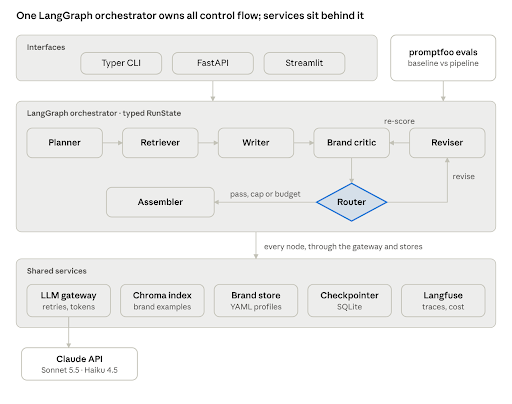

# **BrandForge Architecture Design**

Oct 4, 2026 · David Bailey

BrandForge is a Python multi-agent pipeline, orchestrated with LangGraph, that turns a creative brief into scored, on-brand ad copy variants. It is built as a one-week proof of concept, but designed so that the path to production is clear.

## **Goals, scope and quality attributes**

**Goals**

1. Generate ad copy variants that measurably fit a brand's voice better than a single-prompt baseline.  
2. Show production-grade agent engineering: typed state, bounded loops, graceful failure, full tracing.  
3. Make quality measurable and repeatable through an automated evaluation suite.

**In scope:** text ad copy for up to four channels (search, social, display, email subject), CLI and minimal web UI, three fictional brands, a local vector store, offline evaluation.

**Out of scope (next steps):** image or video generation, fine-tuning, multi-tenant auth, cloud deployment, human-review UI.

**Quality attributes, in priority order**

| Attribute | Target for the POC | How it's achieved |
| :---- | :---- | :---- |
| Output quality | Mean brand-voice score above baseline on the eval set | Critic loop, retrieved brand examples, calibrated judge |
| Reliability | Every run ends in a defined state, never a crash or infinite loop | Schema validation, bounded retries, revision cap |
| Observability | Every agent step traceable with inputs, outputs, tokens, latency | Langfuse callbacks on every node |
| Cost | Known cost per run, reported with each result | Token accounting in state; cheaper model for drafting |
| Latency | One brief end to end in under ~60 seconds | Parallel variant critique; small per-agent contexts |
| Modifiability | Swap model provider or add an agent without touching others | Provider-neutral gateway core with one adapter per provider (Claude, Gemini); agents as pure functions over state  |

The latency target is a working assumption to confirm on day 3.

## **System overview**



Interfaces, orchestrator, shared services Interfaces and the eval harness invoke the same compiled graph. Agents never call each other or a provider directly: the router owns control flow, and every model call goes through the gateway, which handles retries, token accounting and tracing in a provider-neutral core. A thin adapter per provider (Claude, Gemini) translates the call into that provider's SDK. 

## **Components**

Each agent is a pure function: it reads the slice of state it needs and returns a partial state update. No agent calls another directly; the graph decides what runs next.

| Component | Responsibility | Reads | Writes | Model tier |
| :---- | :---- | :---- | :---- | :---- |
| Planner | Turn the brief into a structured plan: audience, angle, channels, variant count | brief, brand | plan | Strong |
| Retriever | Fetch the 3–5 most relevant approved examples for this brand and channel | brand.id, plan | examples | Embeddings only |
| Writer | Produce variants per channel as schema-valid JSON | plan, brand, examples | variants | Fast |
| Brand critic | Score each variant 1–5 on voice, clarity, call to action; explain fixes | variants, brand.rubric | critiques | Strong |
| Router | Decide: all pass, revise, or stop and flag | critiques, revision_count | next node | None (code) |
| Reviser | Rewrite only failing variants using the critic's notes | failing variants, critiques | variants, revision_count | Fast |
| Assembler | Package final variants, scores, flags, cost and trace ID | full state | result | None (code) |
| LLM gateway | One complete_structured(prompt, schema, tier) interface. Provider-neutral core: tier→model resolution, cost, schema validation, portable-schema check, retries, budgets. One adapter per provider (Anthropic, Gemini) builds the request and normalises the reply.  | prompts | completions, usage | — |
| Provider adapters  | One per provider. Build that provider's structured-output request, call its SDK, return text, token counts and a normalised outcome (complete, truncated, refused). No validation, cost or retries  | prompt, schema  | raw completion  | — |
| Brand store | Brand profiles and rubrics as versioned YAML files | — | — | — |
| Example index | Embedded approved copy per brand (Chroma, local) | — | — | — |
| Interfaces | Typer CLI and a thin FastAPI endpoint with a Streamlit page | brief input | result | — |

"Strong" and "fast" are tiers in config, not hard-coded models, so the cost/quality trade-off can be tuned per agent.

## **State model and data contracts**

All data crossing an agent boundary is a Pydantic model. The graph state is the single source of truth for a run, so any run can be replayed from a checkpoint.

```python
class Brief(BaseModel):
    product: str
    audience: str
    objective: Literal["awareness", "consideration", "conversion"]
    channels: list[Channel]  # search | social | display | email
    constraints: list[str] = []  # e.g. "no discounts", "max 90 chars"


class BrandProfile(BaseModel):
    id: str
    voice: list[str]  # "warm", "plain-spoken", ...
    do: list[str]
    dont: list[str]
    banned_words: list[str]
    rubric: Rubric  # criteria + 1-5 anchors


class Variant(BaseModel):
    id: str
    channel: Channel
    headline: str
    body: str
    cta: str


class Critique(BaseModel):
    variant_id: str
    scores: dict[str, int]  # criterion -> 1..5
    overall: float
    passed: bool
    fixes: list[str]


class RunState(TypedDict):
    run_id: str
    brief: Brief
    brand: BrandProfile
    plan: Plan | None
    examples: list[Example]
    variants: list[Variant]
    critiques: list[Critique]
    revision_count: int
    errors: list[RunError]
    usage: Usage  # tokens + cost, accumulated per node
    status: Literal["running", "complete", "partial", "failed"]
    started_at: float  # epoch seconds; the wall-clock budget runs from it
``` 

Critique.scores is shown as dict[str, int] because that is the in-memory shape. Strict structured-output modes cannot express free-form dict keys, so the critic does not ask the model for it. The model returns a CriticReply (a list of {criterion, score} items), and build_critique converts it into a Critique in code, checking that every rubric criterion is present exactly once and computing overall and passed. 

**Contract rules**

* Every LLM output is parsed into its model; a parse failure is a retryable error, not a crash.  
* Agents return only the keys they own (see Components). usage and errors use reducer functions so nodes append rather than overwrite.  
* Brand profiles and rubrics carry a version; the result records which version was used, so eval runs are reproducible.

* Response schemas must be portable across providers: lists of items, never free-form dict fields. The gateway core rejects non-portable schemas before any call is made. 

## **Control flow and failure handling**

The graph is planner → retriever → writer → critic → router, where the router sends failing variants to the reviser and back to the critic at most twice. Every path ends at the assembler, so a run always produces a result with an explicit status.

**Failure handling, by layer**

| Failure | Where it's caught | Handling | Run status |
| :---- | :---- | :---- | :---- |
| API timeout, rate limit, 5xx | LLM gateway | Exponential backoff with jitter, 3 attempts (tenacity) | Continues if a retry succeeds |
| Output fails schema validation | LLM gateway | Re-ask once with the invalid reply and the validation errors in the prompt (`max_schema_repairs`); usage counts both calls | Continues, or node fails |
| Model truncated or refused (output limit, safety block)  | Provider adapter normalises it; gateway core raises StructuredOutputError  | Carries raw text, usage and outcome; not retried blindly (truncation needs a larger limit)  | Node fails, or continues if handled  |
| Node fails after retries | Graph error edge | Record in errors, route to assembler with what exists | partial or failed |
| Variant still below threshold after 2 revisions | Router | Stop revising; mark variant flagged | partial |
| Retriever returns nothing | Retriever | Proceed with zero examples; log a warning | Continues |
| Run exceeds its token or wall-clock budget (`max_tokens_per_run`, `max_wall_clock_seconds`) | Router before a revision; gateway before every model call | Router: no further revisions, variants flagged. Gateway: `BudgetExceededError` fails the node and the run assembles what exists | partial, or failed if nothing was written |

**Design principles**

* **Bounded everything:** retries, revisions, tokens and wall-clock time all have hard limits in config.  
* **Partial over nothing:** a run that has some passing variants returns them, clearly labelled, rather than failing.  
* **Revise only what failed:** the reviser touches failing variants only, which saves tokens and prevents regressions in good ones.  
* **Checkpointing:** LangGraph's SQLite checkpointer stores state after each node, so a failed run can be inspected or resumed.

This is the same compensation thinking as a Saga: each step has a defined outcome on failure, and the orchestrator, not the step, decides what happens next.

## **Proposed tech stack**

The stack favours mainstream, well-documented tools that agent roles ask for by name, and runs entirely on a laptop with one API key.

| Layer | Choice | Why | Alternative considered |
| :---- | :---- | :---- | :---- |
| Language | Python 3.12 | Lingua franca of agent tooling; supported by LangGraph 1.2.x (Python 3.10–3.13) | TypeScript (LangGraph.js) |
| Project tooling | uv, Ruff, mypy, pytest | Fast, reproducible setup; strict typing feels familiar coming from C# | Poetry, Black |
| Orchestration | LangGraph 1.2.x | Explicit graph and typed state, conditional edges, checkpointing; closest to BPMN-style orchestration | CrewAI (less control over state), AutoGen (conversation-centric) |
| Data contracts | Pydantic v2 | Validates every LLM output; generates JSON schemas for structured output | dataclasses + jsonschema |
| LLM provider | Provider-neutral gateway core with adapters: Anthropic SDK (Messages API) and google-genai (generate_content)  | Structured outputs on both; the core owns retries, cost and validation once, and an SDK is imported only when a tier uses it  | OpenAI adapter (if time allows), LiteLLM, LangChain chat models, Claude Agent SDK  |
| Strong tier | Claude Sonnet 5.5 (claude-sonnet-5-5, $2 / $10 per M tokens) | Planner and critic need judgement; best speed/quality balance | Claude Opus 5.5 |
| Fast tier | Claude Haiku 4.5 (claude-haiku-4-5-20251001, $1 / $5 per M tokens) | Writer and reviser run most often; cheapest and fastest | Sonnet for both tiers |
| Tier configuration  | provider:model strings, e.g. anthropic:claude-sonnet-5-5 or gemini:<model-id>, with per-tier prices in config  | Switching a tier's provider is a config change  | Hard-coded model IDs  |
| Judge model | Claude Opus 5.5, optionally cross-checked with a Gemini model (a tier set to gemini:<model-id>)  | A stronger, different model than the generator reduces self-preference bias | Same model as critic (cheaper, more biased) |
| Retries | tenacity | Declarative backoff and retry policies | Hand-rolled loops |
| Retrieval | Chroma (local, persistent) + provider embeddings | Zero-infrastructure vector store; enough for a few hundred examples | pgvector, Qdrant |
| Brand store | Versioned YAML files in the repo | Reviewable in Git; no database needed for the POC | Postgres |
| Checkpointing | LangGraph SQLite checkpointer | Inspect and resume runs locally | Postgres checkpointer (production) |
| Tracing | Langfuse (cloud free tier by default; optional self-hosted Docker Compose) | Open source; the same SDK against either backend; shows agent graphs, tokens, cost | LangSmith, OpenTelemetry + Jaeger |
| Evaluation | promptfoo + LLM-as-a-judge rubric; pytest for deterministic checks | Named in target job specs; YAML test suites run in CI | DeepEval, Ragas |
| Prompt optimisation (stretch) | DSPy | Systematic prompt tuning against the eval set | Manual iteration |
| Interfaces | Typer CLI; FastAPI endpoint; Streamlit demo page | CLI for evals and scripting, API to show service design, Streamlit for the video | Gradio |
| Packaging and CI | Docker, GitHub Actions | One-command run; lint, tests and a small eval subset on every push | — |

Model IDs and prices are from Anthropic's [models overview](https://platform.claude.com/docs/en/models/overview); LangGraph version from [PyPI](https://pypi.org/project/langgraph/). Pin exact versions in pyproject.toml on day one. Gemini model IDs and prices are set in .env; check Google's pricing page if chosen.

## **Evaluation architecture**

The evaluation answers one question: does the full pipeline produce better on-brand copy than a single prompt, and at what cost? It runs offline against a fixed dataset, so results are comparable between changes.

**Dataset:** 3 brands × 10 briefs = 30 cases, one YAML file each under `evals/cases/`. Each case has an id, the brand id, the brief, and any hard constraints a string check can decide: a headline character cap per channel, and phrases the copy must mention. A cap is recorded only when the brief states that same number, so the check matches the instruction the model saw. Banned words stay on the brand profile. The ten CLI sample briefs are the first cases for their brands, with the same brief text. `load_cases` reads and validates the directory (ADR 0026).

**Two systems under test**

1. **Baseline:** one prompt with the brief and brand profile, same model as the writer.  
2. **Pipeline:** the full graph.

**Runner:** promptfoo. `evals/promptfooconfig.yaml` lists both systems as Python providers and one test per case from `load_cases`. `promptfoo eval` runs every case through both. The promptfoo prompt is the case id. Each provider loads that case and calls the baseline or the graph, which still use the versioned prompt files. Both return one JSON row: variants, status, tokens and cost. The baseline has no critic, so `flagged` is null on its rows. A provider that cannot produce a row returns an error and the rest of the run continues (ADR 0027). Deterministic assertions then score that row, in promptfoo and in pytest, with no further model call: valid JSON, the eval-row schema, headline caps, the requested channels, banned words, a call to action, and any required phrase (ADR 0028). The judge rubric scores the same row: one `llm-rubric` grades each variant on its own, through the gateway, on the judge tier, using that brand's 1–5 anchors. The row score is the mean. A second Gemini model can cross-check the same rubric when it is configured (ADR 0029). How the pieces connect, and how to run a case, is in [promptfoo.md](promptfoo.md).

**Three layers of checks**

| Layer | Tool | What it checks | Pass rule |
| :---- | :---- | :---- | :---- |
| Deterministic | promptfoo assertions + pytest | Valid JSON, the eval-row schema, character limits per channel, requested channels present, banned words absent, a call to action, required phrases | 100% must pass |
| Model-graded | promptfoo llm-rubric with the judge model | Brand-voice fit, clarity, CTA strength, each scored 1–5 against anchored descriptions | Report mean and distribution |
| Human calibration | brandforge calibrate on 15 hand-scored outputs | Quadratic weighted kappa between you and the judge | Below 0.60, tune the rubric (ADR 0030) |

**Human calibration:** Fifteen authored outputs live in `evals/calibration/`, five briefs from each brand. Each file is one variant and a hand score for voice, clarity and the call to action. The scores use that brand's anchors, and the same rule as the judge prompt: when the copy sits between two levels, take the lower one. `brandforge calibrate` sends each variant to the judge, alone, and compares those integers with the hand scores. The summary is quadratic weighted kappa on the fixed 1–5 scale, plus exact agreement, within-one agreement and the mean absolute error. Kappa below 0.60 is low agreement, and the rubric anchors are what to tune. The command calls the model. CI checks the files and the arithmetic with a faked judge (ADR 0030).

**Reported per run:** mean score per criterion, pass rate, flagged-variant rate, tokens, cost and latency per brief, all for baseline vs. pipeline side by side.

**Judge bias controls**

* Judge is a different, stronger model than the generator.  
* Rubric anchors describe each score level concretely, with an example.  
* Variants are scored individually, not compared side by side, to avoid position bias.  
* Length limits are enforced deterministically, so the judge isn't rewarding verbosity.

**In CI:** lint and unit tests on every push. The 5-case smoke config is `evals/promptfooconfig.smoke.yaml` (ADR 0031). Its GitHub Actions job is paused until the repository has an `ANTHROPIC_API_KEY` secret. When that job is on, it uses the default Anthropic tiers and calls the model. `uv run poe check` stays offline. The job fails when a provider errors, a deterministic check fails, or the judge cannot grade. A low judge score does not fail it. Fork pull requests skip the job, because they do not receive the API key. The full 30-case run is manual. `brandforge eval-summary` turns that promptfoo export into `evals/results/full.md` and `evals/results/full.json`. The calibration command is manual too. CI checks the 15 files and the agreement arithmetic with a faked judge.

## **Observability, cost and security**

**Observability**

* One Langfuse trace per run, with a span per graph node; each span records model, prompt version, input, output, tokens, latency and errors.  
* The default backend is Langfuse Cloud's free tier (`LANGFUSE_HOST=https://cloud.langfuse.com`). A self-hosted stack is optional and off unless you start it: `deploy/langfuse/docker-compose.yml` (ADR 0022). The SDK configuration is the same either way.  
* The trace ID is returned in the result, printed by the CLI and sent back by `POST /generate`, so any output links straight to how it was produced.  
* Structured JSON logs (structlog) carry the same run_id for correlation.  
* Prompts are versioned files; the prompt version is a span attribute, so eval results tie to exact prompts.

**Cost controls**

* The gateway accumulates tokens and cost into state after every call.  
* Per-run token budget in config; when hit, revisions stop and the best current result is assembled.  
* Fast-tier model for the high-volume writer and reviser calls; strong tier only for planning, critique and judging.  
* Prompt caching for the static parts of prompts (system prompt, brand profile), which repeat on every call in a run.  
* A spending limit on the API account during development.

* Thinking tokens (Gemini) are counted as output tokens, as billed. Prompt-cache pricing differs by provider and is handled in BF-27. 

**Security and data handling**

* API keys from environment variables via pydantic-settings; .env git-ignored; nothing secret in traces.  
* Brief text is treated as untrusted input: it's placed in a clearly delimited section of the prompt, and outputs are schema-validated, so injected instructions can't change the output shape.  
* No real brand or customer data in the repo; all three brands are fictional.  
* `POST /generate` accepts a brand id and a brief and returns the run result, including `trace_id` (null when tracing is off). A finished run is HTTP 200 even when its status is partial or failed; that status is in the body. OpenAPI docs are at `/docs`. `brandforge serve` binds to 127.0.0.1 by default. The endpoint has no auth for the POC; production would add auth, rate limiting and tenant isolation per brand (ADR 0032).

## **Repository structure**
```text
brandforge/  
├── README.md                 # problem, diagram, quickstart, results, limitations  
├── pyproject.toml            # pinned deps, ruff, mypy, pytest config  
├── docker-compose.yml        # API and demo page (BF-41)  
├── deploy/langfuse/          # optional self-hosted Langfuse; cloud free tier is the default  
├── .env.example  
├── docs/  
│   ├── architecture.md       # this document  
│   ├── langfuse.md           # cloud free tier, and the optional local stack  
│   ├── promptfoo.md          # eval runner: providers, the JSON row, how to run a case  
│   └── adr/                  # 0001-langgraph.md, 0002-revision-cap.md, ...  
├── src/brandforge/  
│   ├── config.py             # settings, model tiers, budgets  
│   ├── models.py             # Pydantic contracts + RunState  
│   ├── scoring.py            # build_critique: CriticReply → Critique   
│   ├── graph.py              # nodes, edges, router, checkpointer  
│   ├── agents/               # planner.py, writer.py, critic.py, reviser.py, assembler.py  
│   ├── prompts/              # versioned prompt templates  
│   ├── llm/                  # gateway core, schema guard, provider registry  
│   │   ├── gateway.py        # complete_structured: tiers, cost, validation, retries  
│   │   ├── base.py           # ProviderAdapter protocol, RawCompletion, errors  
│   │   ├── schema.py         # portable-schema check  
│   │   ├── registry.py       # lazy provider → adapter lookup  
│   │   └── adapters/         # anthropic_adapter.py, gemini_adapter.py  
│   ├── retrieval/            # example corpus (YAML); Chroma index build + query  
│   ├── brands/               # brand profiles and rubrics (YAML)  
│   ├── evals/                # cases (BF-33); promptfoo (BF-34); assertions (BF-35); judge (BF-36); calibration (BF-37); results (BF-38)  
│   └── interfaces/           # cli.py (Typer), api.py (FastAPI, BF-39), app.py (Streamlit)  
├── evals/  
│   ├── cases/                # 30 brief cases, one YAML file each (BF-33)  
│   ├── providers/            # promptfoo providers (BF-34), assertions (BF-35), judge grader (BF-36)  
│   ├── promptfooconfig.yaml  # both providers, the cases, deterministic checks, judge rubric (BF-34–BF-36)  
│   ├── promptfooconfig.smoke.yaml  # five cases, the CI smoke eval (BF-38)  
│   ├── calibration/          # 15 hand-scored outputs; brandforge calibrate (BF-37)  
│   └── results/              # full.md and full.json from the manual run (BF-38)  
├── tests/                    # unit tests: router logic, schemas, gateway (LLM mocked)  
└── .github/workflows/ci.yml  # lint, type-check, tests; 5-case smoke job paused
```
## **Decisions and open questions**

| ADR | Decision | Reason | Trade-off accepted |
| :---- | :---- | :---- | :---- |
| 0001 | LangGraph for orchestration | Explicit state machine with checkpointing; control over every transition | More code than CrewAI's role-based setup |
| 0002 | Workflow with one evaluator loop, not autonomous agents | The task has a known shape; a fixed graph is cheaper, testable and predictable | Less flexibility for unusual briefs |
| 0003 | Revision loop capped at 2 passes; flag rather than fail | Bounded cost and latency; partial results are still useful | Some variants ship flagged instead of fixed |
| 0004 | Two model tiers set in config | Cuts cost on high-volume calls; tiers can be tuned per agent from eval data | Fast tier may need more revisions |
| 0005 | Judge model differs from generator | Reduces self-preference bias in scores | Higher eval cost |
| 0006 | Pydantic contracts at every boundary | Malformed output is caught at the source and retried | Slightly more prompt and schema work |
| 0007 | Local-first (Chroma, SQLite, YAML) | Clone-and-run in minutes; no infrastructure to explain | Not multi-user; production swaps to Postgres/pgvector |
| 0008 | Own gateway with one adapter per provider (Claude, Gemini)  | Retry, cost and validation written once; providers swappable by config; no agent framework or MCP in the call path  | We own the glue; adapters must stay behaviourally aligned  |

**Open questions**

* What pass threshold per criterion gives the best quality/cost balance? Decide from eval data on day 5 (starting point: overall ≥ 4.0, no criterion below 3).  
* Should the critic score variants in parallel (faster) or in one call (cheaper, shared context)? Measure both on day 3.  
* Is retrieval worth its complexity here? Compare eval scores with and without examples.

* Google recommends its newer Interactions API for new work; the adapter uses generate_content, which is fully supported and not deprecated. Revisit only if BrandForge needs server-side state or built-in tools, which it does not.  
* Do thinking-enabled models exhaust the default 2,048-token output limit? If a call comes back truncated, raise BRANDFORGE_BUDGETS__MAX_OUTPUT_TOKENS_PER_CALL.

**Path to production (not built)**

Postgres checkpointer and pgvector, multi-tenant brand isolation, auth on the API, a human-review queue for flagged variants, eval gates on prompt changes in CI, and online A/B testing of variants against real performance data.