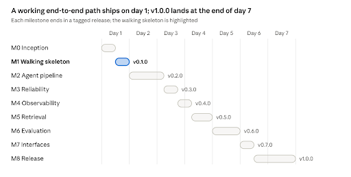

# **BrandForge Build Plan**

Oct 4, 2026 · David Bailey

Build BrandForge as nine milestones of small, shippable tasks: get a thin end-to-end path working on day one, then thicken it. Every task is one branch, one pull request and a green build, so the public repo shows steady, reviewable progress from the first hour.

## **Roadmap**

Build roadmap · 9 milestones across 7 days

Days 2–5 carry the core evidence (pipeline, reliability, evals); days 6–7 make it easy for someone else to run and judge.

## **Slicing approach and Git workflow**

**Slice vertically, not by layer.** Milestone 1 is a walking skeleton: a brief goes in through the CLI and validated copy comes out, with one LLM call and no agents. Every later milestone thickens that working path. If time runs out on any day, the repo still runs end to end.

**Task size:** 1–3 hours each, small enough to finish in one sitting and describe in one PR title. A task that grows past half a day gets split.

**Order rule:** contracts before behaviour, behaviour before polish. Each milestone ends in a tagged release, so an interviewer can check out any tag and see a working stage.

**Git workflow (solo, but reviewable)**

* Track each task as a GitHub issue (BF-01, BF-02, …) under a milestone with the same name as below; the issue body is the task's "done when".  
* One branch per task: feat/bf-07-planner-agent, chore/bf-02-ci, docs/bf-40-readme.  
* Conventional commits: feat(agents): add planner node, test(router): cover revision cap, docs(adr): 0003 revision cap.  
* Open a PR per task with Closes \#\<issue\>, a two-line summary and, where relevant, a screenshot or sample output. Squash-merge once CI is green.  
* Tag the end of each milestone: v0.1.0 (skeleton) through v1.0.0 (release), with short release notes.  
* Never commit .env, API keys or generated Chroma/SQLite files; keep them in .gitignore from the first commit.

## **Milestone tasks**

45 tasks in nine milestones (M0–M8). Each line is one issue, one branch and one PR; the text after the dash is its done-when.

### **M0 Inception · day 1 morning · no tag**

* ☐ **BF-01 Create repo and scaffold** — public repo with MIT licence, .gitignore, src/brandforge/ package layout, README stub saying "in active development", and uv project with pinned Python 3.12.  
* ☐ **BF-02 Tooling** — Ruff, mypy (strict) and pytest configured in pyproject.toml; make check (or a uv run script) runs all three; pre-commit hook installed.  
* ☐ **BF-03 CI pipeline** — GitHub Actions runs lint, type-check and tests on every push and PR; status badge in README.  
* ☐ **BF-04 Settings and secrets** — config.py with pydantic-settings reading .env; .env.example committed; model tiers, budgets and thresholds defined in config.  
* ☐ **BF-05 Docs skeleton** — docs/architecture.md (exported from the design doc) and docs/adr/ with a template and ADR 0001 (LangGraph).

### **M1 Walking skeleton · day 1 afternoon · v0.1.0**

* ☐ **BF-06 Data contracts** — Brief, BrandProfile, Variant, Critique, Usage models in models.py, with unit tests for validation edge cases.  
* ☐ **BF-07 Brand store** — three fictional brand profiles plus rubrics as YAML; a loader that validates them into BrandProfile.  
* **BF-08 LLM gateway, minimal** — one complete\_structured(prompt, schema, tier) function that returns a validated model and its Usage. Provider-neutral core (tier resolution, cost, validation, portable-schema check) with a ProviderAdapter seam; the Anthropic adapter (Messages API) is the first implementation. ADR 0008\.   
* ☐ **BF-08b Gemini adapter** — GeminiAdapter over google-genai (generate\_content with a JSON-schema response config), registered as the gemini provider. Thinking tokens count as output; finish reasons map to complete, truncated or refused. A tier set to gemini:\<model-id\> runs end to end with its own prices; tests use a fake client.   
* ☐ **BF-09 Baseline generator** — single-prompt brief → variants function; prompt stored as a versioned file in prompts/.  
* ☐ **BF-10 CLI** — brandforge generate \--brand X \--brief brief.yaml prints variants and token cost.  
* ☐ **BF-11 Sample briefs** — ten brief YAML files across the three brands, used by the CLI and later by evals.

### **M2 Agent pipeline · day 2 → day 3 · v0.2.0**

* ☐ **BF-12 RunState and graph shell** — RunState TypedDict with reducers for usage and errors; compiled LangGraph with a single pass-through node; CLI switched to run the graph.  
* ☐ **BF-13 Planner agent** — node returns a validated Plan; unit test with a mocked gateway.  
* ☐ **BF-14 Writer agent** — node turns the plan into variants per channel; the baseline prompt is retired into the writer prompt.  
* ☐ **BF-15 Brand critic agent** — node asks the model for a CriticReply (a list of criterion scores), converts it with build\_critique into a Critique, scores every variant against the brand rubric and sets passed.   
* ☐ **BF-16 Router** — pure function deciding assemble / revise / stop; tests cover all-pass, revise, cap reached and budget reached.  
* ☐ **BF-17 Reviser agent** — rewrites only failing variants using critic fixes; increments revision\_count; conditional edges wired so the loop runs at most twice.  
* ☐ **BF-18 Assembler** — builds the final result with status, flags, scores and total cost; CLI prints a readable summary table.  
* ☐ **BF-19 ADRs 0002–0004** — workflow-not-autonomy, revision cap, model tiers.

### **M3 Reliability · day 3 · v0.3.0**

* ☐ **BF-20 Gateway retries** — tenacity backoff with jitter on timeouts, rate limits and 5xx; tests with a fake client that fails twice then succeeds. Each adapter maps its SDK's timeout, rate-limit and 5xx errors to gateway errors so the retry policy is written once in the core.   
* ☐ **BF-21 Schema-repair retry** — on validation failure, re-ask once with the error included; test with a malformed fake response.  
* ☐ **BF-22 Error edges** — a node that fails after retries records a RunError and routes to the assembler; status becomes partial or failed, never an exception.  
* ☐ **BF-23 Token and time budgets** — gateway checks the per-run budget; router stops revisions when it is exceeded.  
* ☐ **BF-24 Checkpointing** — SQLite checkpointer enabled; brandforge inspect \<run\_id\> shows the state after each node.

### **M4 Observability and cost · day 3 → day 4 · v0.4.0**

* ☐ **BF-25 Langfuse tracing** — one trace per run, one span per node, with model, prompt version, tokens and latency; trace ID printed by the CLI. Tracing hooks into the gateway core, not into a provider adapter   
* ☐ **BF-26 Structured logging** — structlog JSON logs carrying run\_id.  
* ☐ **BF-27 Prompt caching and cost report** — static prompt parts cached; cost per run broken down by node in the CLI output. Cache pricing is per provider (Anthropic and Gemini differ).   
* ☐ **BF-28 Docker Compose for Langfuse** — optional self-hosted Langfuse documented, with the cloud free tier as the default.

### **M5 Retrieval · day 4 · v0.5.0**

* ☐ **BF-29 Example corpus** — 15–20 approved example ads per brand as YAML (fictional, written by you).  
* ☐ **BF-30 Index build** — brandforge index embeds examples into a persistent Chroma collection per brand.  
* ☐ **BF-31 Retriever node** — fetches the top examples by brand and channel into state; an empty result is handled gracefully.  
* ☐ **BF-32 Retrieval toggle** — config flag to switch retrieval off, so evals can compare with and without it.

### **M6 Evaluation · day 5 · v0.6.0**

* ☐ **BF-33 Eval cases** — 30 cases (3 brands × 10 briefs) in evals/cases/.  
* ☐ **BF-34 promptfoo providers** — baseline and pipeline exposed as promptfoo Python providers; promptfoo eval runs both.  
* ☐ **BF-35 Deterministic assertions** — valid JSON, channel length limits, banned words, CTA present.  
* ☐ **BF-36 Judge rubric** — llm-rubric assertions with anchored 1–5 criteria, using the judge model. Optionally cross-check the judge with a Gemini tier.   
* ☐ **BF-37 Judge calibration** — your hand scores for 15 outputs in evals/calibration/; script reports agreement with the judge.  
* ☐ **BF-38 Results and CI smoke test** — full run results committed to evals/results/; a 5-case smoke eval added to CI.

### **M7 Interfaces · day 6 · v0.7.0**

* ☐ **BF-39 FastAPI endpoint** — POST /generate returns the result and trace ID; OpenAPI docs render.  
* ☐ **BF-40 Streamlit demo page** — pick a brand, paste a brief, see variants, scores and flags.  
* ☐ **BF-41 Dockerfile** — docker compose up starts the API and demo page with one API key.

### **M8 Release · day 6 → day 7 · v1.0.0**

* ☐ **BF-42 README** — problem, architecture diagram, five-minute quickstart, eval results table, limitations, next steps.  
* ☐ **BF-43 Remaining ADRs** — 0005 (judge model), 0006 (Pydantic contracts), 0007 (local-first), plus any decisions made during the build. ADR 0008 (gateway and adapters) was written with BF-08.   
* ☐ **BF-44 Clean-run check** — fresh clone on a clean machine or container follows the README exactly and succeeds.  
* ☐ **BF-45 Demo video and release** — 2–3 minute video linked from the README; v1.0.0 tagged with release notes.

**If you fall behind,** cut in this order: BF-28, BF-40, BF-41, BF-32, BF-39. Never cut M1–M3 or M6: the working pipeline, its reliability and its eval results are the evidence interviewers look for. An OpenAI adapter is optional: add it only if time allows after M3.

## **Definition of done**

A task is done, and its PR is merged, only when all of these hold:

* ☐ CI is green: Ruff, mypy strict and pytest all pass.  
* ☐ New logic has unit tests; LLM calls are mocked in unit tests, never hit for real in CI except the eval smoke test.  
* ☐ brandforge generate still runs end to end on a sample brief.  
* ☐ Any new prompt is a versioned file, not an inline string.  
* ☐ Any new config value is in .env.example or config.py with a default.  
* ☐ A decision that would surprise a reader has an ADR or a line in the existing one.  
* ☐ The PR description says what changed and how you checked it.